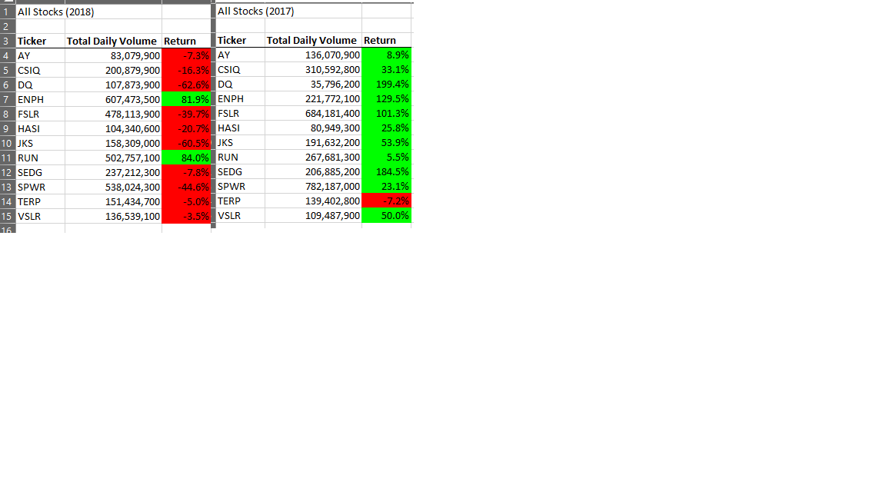

# stock-analysis
## Overview of Project: 
The purpose of this project is to analyze stock data using Microsoft Excel Visual Basic for Applications (VBA) to calculate total daily volume and returns (%) for the following stock: AY, CSIQ, DQ, ENPH, FSLR, HASI, JKS, RUN, SEDG, SPWR, TERP, VSLR. Stock data was gathered from 1/1/2017 through 12/31/2018 and used to calculate the metrics used in the stock analysis. The goal is create a model that could process thousands of stock by refactoring code to perform 'for loop' functions for larger datasets.

## Results: 

Overall 2017 out performed 2018 in returns for the twelve stock analyzed in the code. For example, SEDG showed a 185% return in 2017 versus 7.8% loss in 2018. 
In addition, the time saved on refactoring the code versus performing each line of code for all twelve stocks was tremendous! Both years took less than one second to execute. This would be outstanding time savings when analyzing thousands of stock! 

## Summary: In a summary statement, address the following questions.

In summary the advantage to refactoring includes simplifying code to iterate through large data and perform calculations in a short amount of time. However, the disadvantage is that the code takes longer to develop and has more room for error when compared to doing each step at a time. For example, the syntax is sensitive and could become frustrating when troubleshooting. 

The pros to refactoring the code were the efficiency of taking code and configuring it to run through each of the stock. A con for refactoring the code is performing diagnostics on errors, specifically for the embedded for loops.

